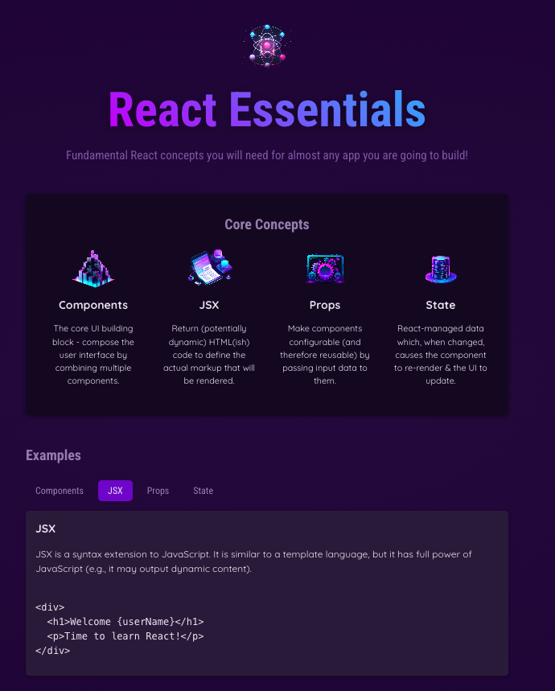

# React Essentials

This project is a small demo of a React-based presentation website. Its features include: 
- On every page reload, the word "Fundamental" in the heading text will be replaced by a word from a given set 
- Selecting an Example will load the description in the box below
- The content of the site reflect the concepts learned

To run the application: 
`npm install`
`npm run dev`

# Dynamic webpage

## Notes 
links from the course:
https://developer.mozilla.org/en-US/docs/Web/JavaScript/Reference/Operators/Destructuring_assignment#rest_property

## Next steps
- publish the website 